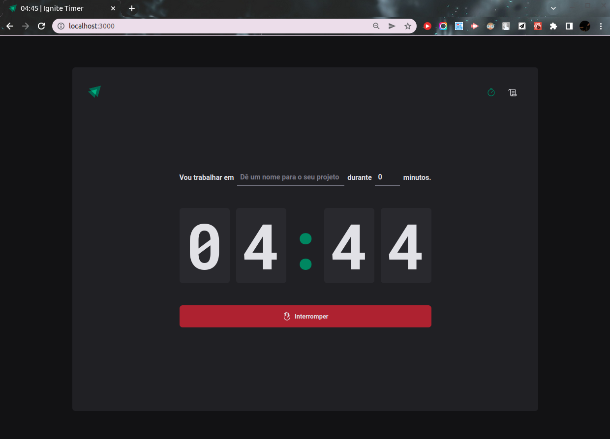
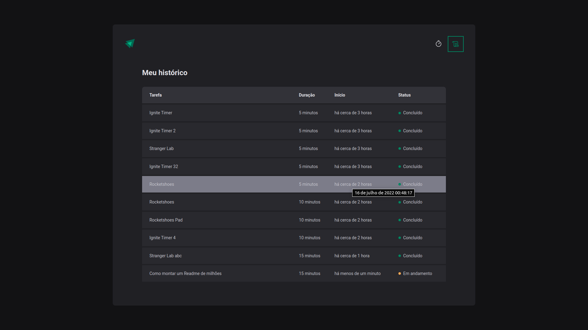
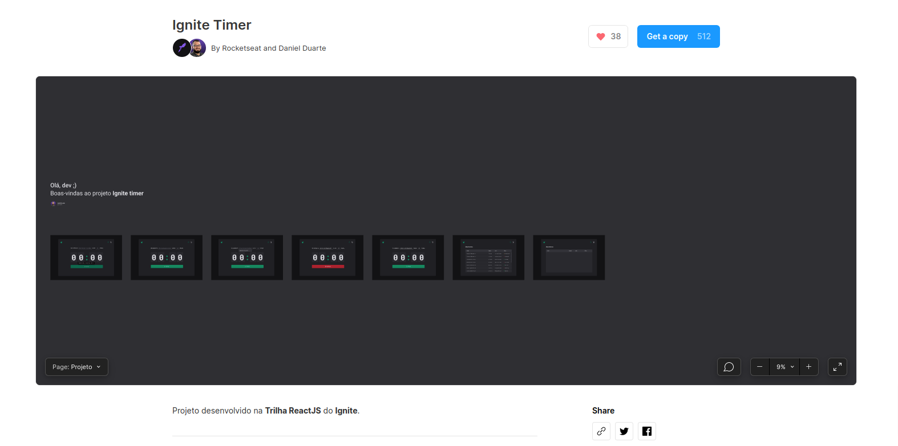

<h2 align="center">
   Ignite Timer | 
</h2>

<p align="center">


</p>

<p align="center">
  <a href="#-projeto">Projeto</a>&nbsp;&nbsp;&nbsp;|&nbsp;&nbsp;&nbsp;
  <a href="#-como-rodar-o-projeto">Como rodar o projeto</a>&nbsp;&nbsp;&nbsp;|&nbsp;&nbsp;&nbsp;
  <a href="#-extensões-vscode">Extensões VsCode</a>&nbsp;&nbsp;&nbsp;|&nbsp;&nbsp;&nbsp;
  <a href="#-tecnologias">Tecnologias</a>&nbsp;&nbsp;&nbsp;|&nbsp;&nbsp;&nbsp;
  <a href="#-Layout">Layout</a>&nbsp;&nbsp;&nbsp;|&nbsp;&nbsp;&nbsp;
  <a href="#-licença">Licença</a>
</p>

## 💻 Projeto

O **Ignite Timer** é uma aplicação no modelo de Pomodoro. **Pomodoro** é uma metodologia de estudo onde a pessoa fica totalmente focado em uma tarefa por um tempo específico e depois tira um tempo de descanso.

Nesta aplicação é possível dá um nome para a tarefa, definir o tempo de foco. Também há um histórico dos pomodoris realizados.

Projeto foi hospedado na Vercel. Acesse o **Ignite Timer** desenvolvido [clicando aqui]().




## 🧭 Como rodar o projeto

**Clone este repositório**

```bash
git clone https://github.com/vitorsemidio-dev/projeto.git
```

**Acesse a pasta**

```bash
cd projeto
```

**Instale as dependências**

```bash
npm install
```

**Execute a aplicação**

```bash
npm run dev
```

## 🎉 Extensões VsCode

- [Styled Components](https://marketplace.visualstudio.com/items?itemName=styled-components.vscode-styled-components)

## 🚀 Tecnologias

Esse projeto foi desenvolvido com as seguintes tecnologias:

- [ReactJS](https://pt-br.reactjs.org/)
- [Styled Components](https://styled-components.com/)
- [TypeScript](https://www.typescriptlang.org/pt/)
- [Vite](https://vitejs.dev/)

## 🔖 Layout

Você pode visualizar o layout do projeto através [desse link](https://www.figma.com/community/file/1127351821076435124). É necessário ter conta no [Figma](https://figma.com) para acessá-lo.



## 📝 Licença

Esse projeto está sob a licença MIT. Veja o arquivo [LICENSE](LICENSE) para mais detalhes.
